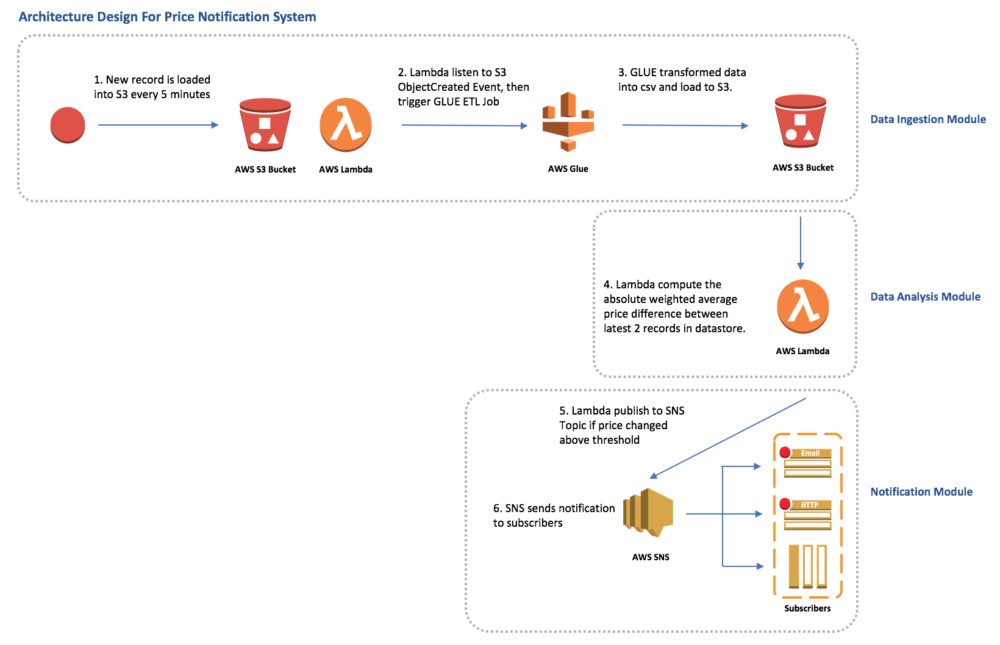

# Price Notification System

## Time Allocation
Research:  
Learning:  
Design:  
Implementation:  
Documentation:  

----
## AWS Architecture Design Diagram

### Architecture Design Description
1. Source data of latest ETH price is loaded into S3 Bucket. The data consist of 1 price record and can be in any format (xml, json, text, etc)
2. AWS Lambda listen to the `s3:ObjectCreated` event for the bucket with prefix of `/crypto/01-data-ingestion`, and trigger AWS Glue to run ETL job on the data. Glue crawler can be used when the data format has changed to map to the desired schema.
3. Set AWS Glue output format to be csv, and load the output file to S3 bucket at sub folder `/crypto/02-data-analysis`.
4. AWS Lambda listen to the `s3:ObjectCreated` event for the bucket with prefix of `/crypto/02-data-analysis`, and trigger a lambda function to calculate the absolute price change percentage of the latest `weightedAverage` with the previous `weightedAverage`.
5. AWS Lambda publish to SNS topic if the percentage price changed is above the threshold.
6. AWS SNS send out notification to the subscribers.

----
## Design Assumptions
1. The data source is store in s3 bucket at sub folder `/crypto/01-data-ingestion`
2. Every 5 minutes there will be an s3 object created in sub folder `/crypto/01-data-ingestion` with 1 price record
3. The data ingestion module will transform the individual price records in `/crypto/01-data-ingestion` to csv file and load to the s3 bucket at sub folder `/crypto/02-data-analysis`

----
## Constraints of Design
// constraints

----
## Improvements
// improvements

----
## Tradeoffs of Design
// tradeoffs 
